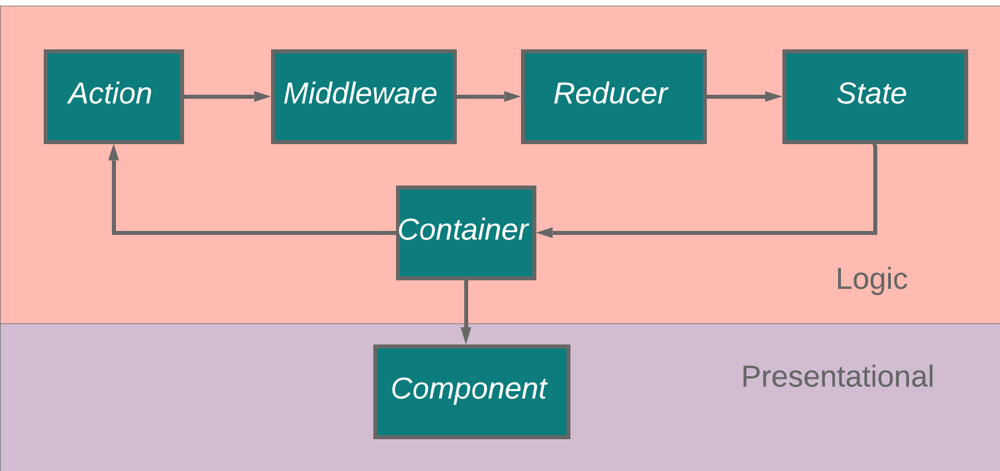

# MULTI-SELECT

## Requirements/Dependencies

- Node 11.15.0
- Yarn 1.16.0

## Setup

- Clone the repository
- Run server `node server.js`
- Install yarn modules `yarn install`
- Start and serve frontend `yarn start`
- Visit http://localhost:8080/

## Tests

- Run unit tests `yarn test`

## Folder structure

- Most important files are located at `src` folder
  - actions
  - containers
  - components
  - reducers
  - selectors
  - store
  - test files are located under `__tests__` folders in the corresponding file

## Libraries

- React(+ React-DOM), Redux(+ React Redux)
  - Maintainability
  - Easy to use
  - Single source of truth with Redux store
  - Read only state
- TypeScript
  - Type safety
- Jest & Enzyme
  - Unit Testing
- React-jss
  - CSS in JS

## Architecture

This app follows Redux architecture and follows its best practices. Presentational layer (views) is separated by the logic layer where actions, reducer, state, and container interact with each other. Some actions communicate with the API as well.

Below you can see separation of presentational and logic layers.

- The separation of presentation and logic layers have multiple benefits one of which is testability.
- Presentational layer is concerned with the view
- Logic layer is concerned with providing data, calling redux actions, and stateful.
- As the app grows, new reducers can be added to manage growing root state
- Redux state is predictable and read-only. Redux store as a single source of truth handles the state and listens to actions.

## Other features

- Items are appended to the DOM as the user scrolls through the list. This prevents performance issues while working with large number of items.
- Selected items are stored in the browser's local storage.
- CSS in JS. This has multiple benefits such as style sheets are created only when a component mounts.

## Basic flow

- User should see list of items upon page load
- User should be able to scroll and see more items
- User should be able to select multiple items. When doing so the scroll position should not change to allow a better UX
- Selected items should go on top of the list
- User should be able to filter items using searchbar. Selected items still should remain on top even if they don't match the search query
- If the user refreshes page, selected items should still remain selected
- If user submits the list, items should be cleared (none of them is selected)
- If there are errors, they should be shown to the user

